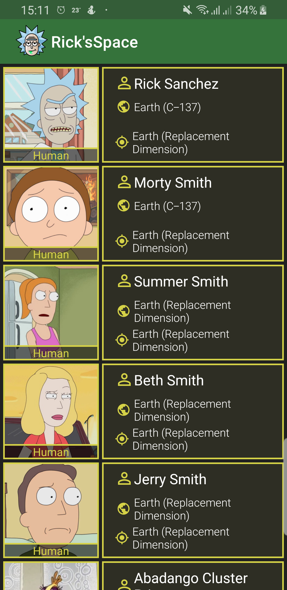
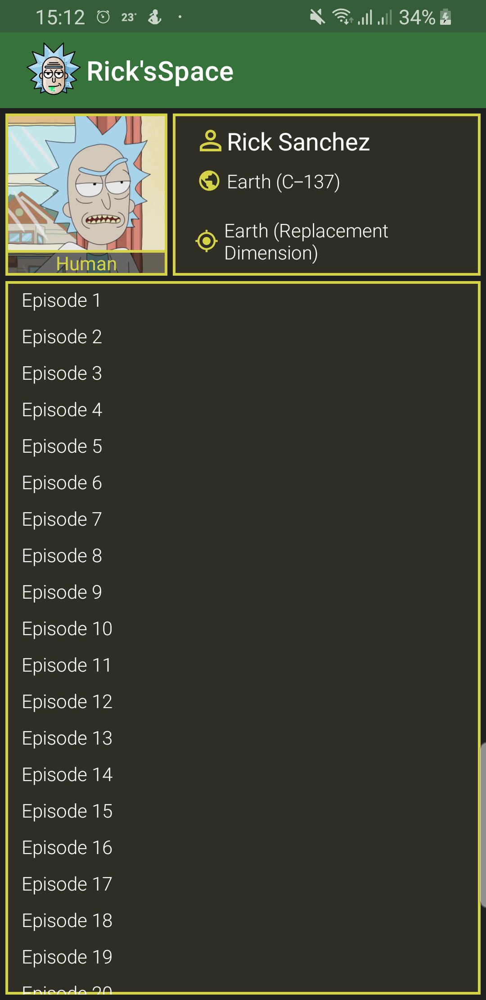

# Rick's Space

This is just a sample app using [rickandmortyapi.com](https://rickandmortyapi.com/).
The app has just two screens, one screen with the list of RickAndMorty characters and a second screen a detailed view of the character.

## Screens
**Character list screen** 

 
**Character details** 

## Tech-stack
This project is written in kotlin and takes advantage of many popular
libraries and tools of the Android ecosystem.
Some of the libraries used:
* [androidx.paging](https://developer.android.com/jetpack/androidx/releases/paging)
* [androidx.navigation](https://developer.android.com/guide/navigation/navigation-getting-started)
* [androidx.room:room](https://developer.android.com/jetpack/androidx/releases/room)
* [bumptech.glide](https://github.com/bumptech/glide)
* [squareup.moshi](https://github.com/square/moshi)
* [google.dagger](https://github.com/google/dagger)
* [coroutines](https://kotlinlang.org/docs/reference/coroutines-overview.html)
* [mockito](https://site.mockito.org/)
* [androidx.espresso](https://developer.android.com/training/testing/espresso/setup)
* [robolectric](http://robolectric.org/)